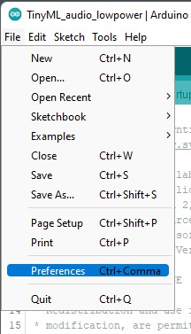
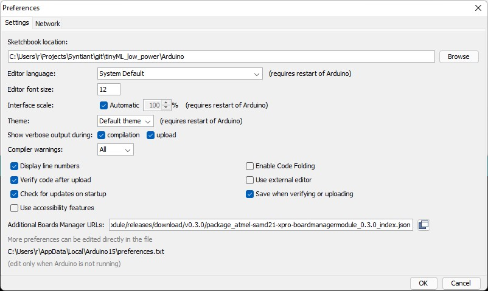
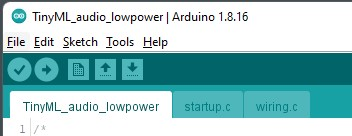
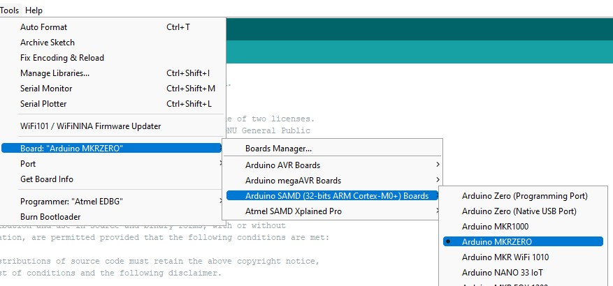

# tinyML_low_power
This repository contains Arduino project files that demonstrate how to configure
the [Syntiant Tiny Machine Learning Development Board](https://www.syntiant.com/tinyml)
to run in reduced power mode, specifically for battery operated devices.

`-- rdpoor Jan 2022`

## Overview

The TinyML board contains a few key components: the [Syntiant NDP101 Neural Decision Processor](https://www.syntiant.com/ndp101),
a MEMs microphone and a Microchip SAM21 host microcontroller.  The NDP101 and
the microphone run continually and don't draw much power.  By contrast, the
SAMD21 microcontroller consumes the lions share of power while it is running.

This project configures the SAMD21 microcontroller to enter a low-power idle
mode until the NDP101 notifies it that a wake word has been detected.  The
SAMD21 then wakes up and processes the notification before returning to the
low-power mode.  

## Requirements

To build and run this project, you will need:
* The [Arduino IDE](https://www.arduino.cc/en/software).  This code has been
tested in Arduino version 1.8.16.
* The [Syntiant Tiny Machine Learning Development Board](https://www.syntiant.com/tinyml)
* A USB cable to connect the TinyML board to your laptop or PC.

## To install and run the code

### 1. Create the project directory

In this document, we will assume you have created a directory named
`TinyML_low_power`, but it could be anything you choose.

### 2. Download the project from Github

In a shell window,

```
cd TinyML_low_power
git clone git@github.com:rdpoor/tinyml_low_power.git
```

### 3. Launch Arduino and configure its Sketchbook location

To use the Syntiant specific library files, you will need to set where Arduino
searches for library files.  Click on `File => Preferences` and edit the
Sketchbook location: field to point to your `TinyML_low_power/Arduino`
directory:





### 4. Open the TinyML_audio_lowpower sketch

In the Arduino application, click on File => Open and select the
`TinyML_audio_lowpower.ino` sketch.  Check that it opens not only the .ino file,
but two other files: `startup.c` and `wiring.c`.  These are customized versions
of the standard Arduino support files.  (More on this later)



### 5. Connect and select the TinyML board

Connect your TinyML board to your computer using the USB cable.  In the Arduino
application, select `Tools => Board => Arduino SAMD => Arduino MKRZERO`.



### 6. Compile and upload the sketch

In the Arduino application, select `Sketch => Upload`.  This will compile the
code and load it into the TinyML board.  In case of trouble, see Troubleshooting
below.

### 7. Test the sketch

On the TinyML board, with the USB cable still connected, the amber LED should be
blinking continually.  When you say "Alexa, play music", the green LED should
blink on briefly to show that the NDP1000 recognized the phrase.  When you say
"Alexa, stop music", the blue LED should blink briefly.

## Troubleshooting

It is assumed that your TinyML board has never gone through the formatting process of the serial flash which is conducted by “:F” command in the serial monitor window. If the RGB LED is stuck in “Blue” color, then it is likely that “google10.bin” is either deleted or got corrupted. Please follow the tutorial under https://www.syntiant.com/tinyml page. This will populate the “ei_model.bin” file in the serial flash of the TinyML board. Change the sketch’s line #85. Replace “google10.bin” with “ei_model.bin” . Then use “go” and “stop” keywords to test it.  

## Implementation Details

To attain low power, this project makes the following changes to the stock
`startup.c` and `wiring.c`, which typically resides in the file:

```
~/AppData/Local/Arduino15/packages/arduino/hardware/samd/1.8.x/cores/arduino/
```
Searching for lines that contain the comment \[rdp\] will highlight the
changes, but in summary:

* The external XOSC32K is configured to run in standby.
* XOSC32K drives GCLK5 at 32KHz, which in turn feeds the DFLL
* GCLK5 is configured to make its 32KHz signal available on Arduino pin 3,
required by the NDP1000 for normal operation
* In wiring.c, all GPIO pins are initially disabled rather than left to float.
(Floating input lines can be a source of extra power consumption.)
